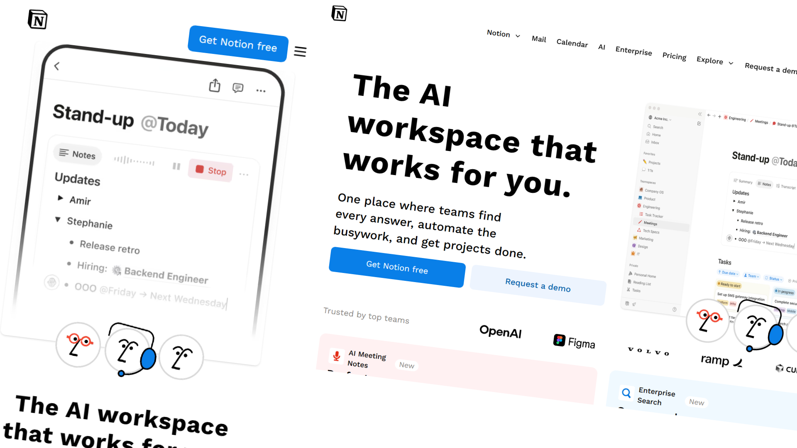

# 🌐 Notion Landing Page Clone

A `functional` pixel-perfect clone of the Notion landing page built with ReactJS, TailwindCSS, and Vite.

## 🎨 Overview

This project is a **Design to Code** conversion that I built to practice and showcase my **frontend development skills** through real-world UI implementation.

It focuses on `clean structure`, `responsive layout`, and maintainable code.

## 📸 Preview



## 🔗 Live Demo

[🌍 Visit Site](https://notion-landing-page-fr.vercel.app/)

## 🧰 Tech Stack

-  ⚛️ React
-  🎨 Tailwind CSS
-  🛠️ Vite

## 🧠 Key Learnings

-  🔥 Improved understanding of `semantic html writing` **layout building**
-  🔥 Learned to optimize image implementation for high performance using best practices
-  Practiced **responsive design**
-  Strengthened **Design-to-code workflow**
-  Learned to translate design tokens — **colors, spacing, typography, and alignment** — into clean, consistent code

## 📁 Folder Structure

```
src/
  App.jsx
  main.jsx
  components/
    header/
    hero/
    showcase/
    teamusecase/
    testimonials/
    products/
    footer/
  lib/
```

## 💡 Features

-  ✅ Pixel-perfect
-  ✅ Fully responsive (mobile-first)
-  ✅ Reusable components
-  ✅ Semantic HTML structure
-  ✅ Use Case Showcase with Functional Tabs

## 🧱 Design Reference

-  🎨 Notion Landing Page: [View Design](https://www.notion.com/)

## 🚀 Getting Started

```bash
# Clone project
git clone https://github.com/fazle-rabbi-dev/Notion-Landing-Page.git

# Move into folder
cd Notion-Landing-Page

# Install dependencies
npm install

# Run locally
npm run dev
```
